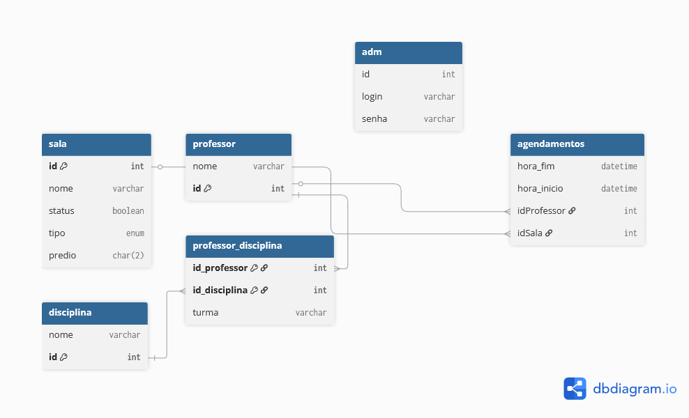

[](https://classroom.github.com/a/agg6sSBC)
# Projeto Agenda Poli

Um sistema de agendamento para salas para professores agendarem horários e alunos visitarem o agendamento
de salas, com um administrador geral para o sistema

## Sumário

* [Pré-requisitos](#pré-requisitos)
* [Instalação](#instalação)
* [Instruções de uso](#instruções-de-uso)
* [Contato](#contato)
* [Documentação](#documentacao)

## Modelo ER


## Pré-requisitos

| Configuração        | Valor                    |
|---------------------|--------------------------|
| Sistema operacional | Windows 10 Pro (64 bits) |
| Processador         | Intel core i7 9700       |
| Memória RAM         | 16GB                     |
| Necessita rede?     | Sim                      |


## Instalação

- IDE VsCode **obrigatótio**
- Intellij **opcional mas recomendado**
- Docker (com wsl se for windows) **obrigatório**
- Postgres + pgadmin **opcional mas recomendado se não tiver docker**
- JDK21 **obrigatório**
- nodeJS **obrigatório**

```bash
sudo apt-get install nano
```

## Instruções de Uso

```bash
echo "olá mundo!"
```

## Contato

O repositório foi originalmente desenvolvido por Fulano: [fulano@ufsm.br]()

## documentacao de apoio
* [link para o figma](https://www.figma.com/design/cZoiSPsSOjAio7jQksXsnF/Marca%C3%A7%C3%A3o-de-sala--Eng-De-Software-?node-id=0-1&t=VGR2Ehy1dGJEXv2G-1)
* [Documentação coplin-db2](https://pypi.org/project/coplin-db2/)
