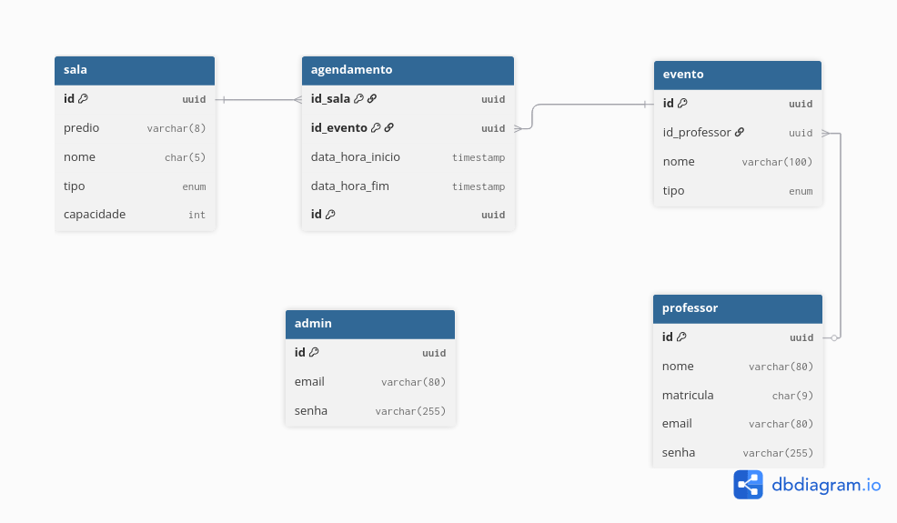
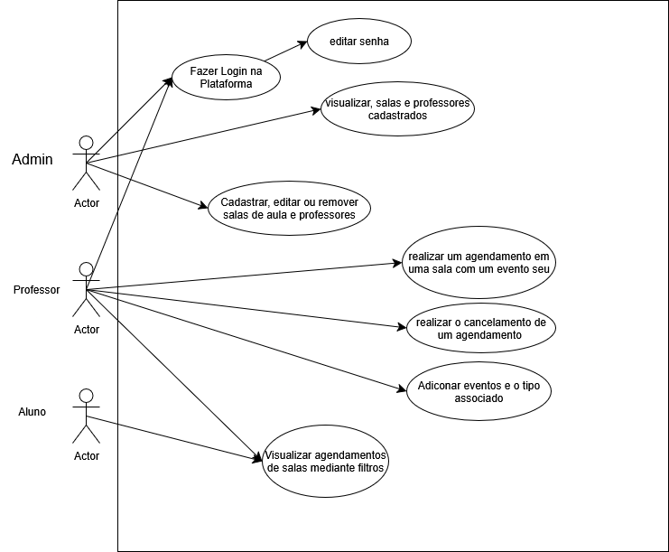

# Documentação do Banco de Dados

## Visão Geral

O sistema utiliza PostgreSQL como banco de dados principal, com migrações gerenciadas pelo Flyway. O banco é projetado para suportar agendamentos de salas universitárias com controle de conflitos de horário e validações de integridade.

## Estrutura do Banco

### Diagrama ER

## Migrações

### V1__Create_tables.sql

Criação inicial das tabelas com:
- Tabelas principais (admin, professor, evento, sala, agendamento)
- Constraints de validação

### V2__script_dados_inicializacao.sql

Dados iniciais para desenvolvimento e testes:
- 1 administrador padrão
- 5 professores de exemplo
- 14 salas distribuídas pelos prédios
- 18 eventos diversos
- 5 agendamentos de exemplo

### Criptografia

- Senhas devem ser criptografadas usando BCrypt
- Dados sensíveis devem ser mascarados em logs

## Diagramas de casos de Uso
